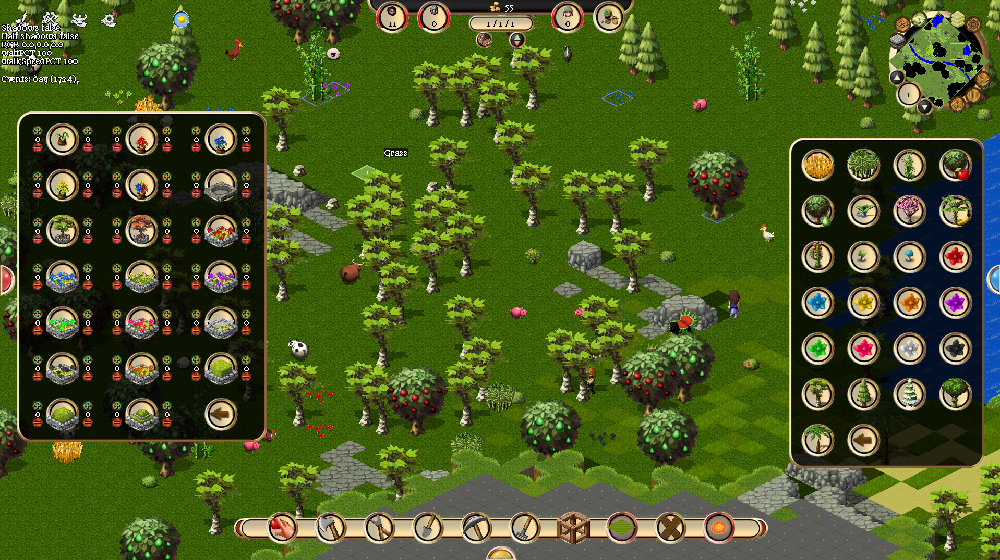

# Towns++ Compatibility

Towns++ support is designed as a compatibility path, not as a bundled mod.

This repository and its release archives do not redistribute Towns++ data, graphics, audio, fonts, or other mod content. Until the Towns++ author grants explicit redistribution terms, users should apply Towns++ from their own local copy.

## Compatibility Proof



## Packaged Release Install

1. Install or verify Towns through Steam.
2. Extract the TownsForever release archive over the Steam Towns install folder.
3. Overlay your own Towns++ copy into the same folder:

```text
Towns-plus-plus/data/        -> <Steam Towns>/data/
Towns-plus-plus/graphics.ini -> <Steam Towns>/graphics.ini
Towns-plus-plus/towns.ini    -> <Steam Towns>/towns.ini
```

4. Launch `Towns.exe` from the install folder.

The release archive intentionally does not include original Towns runtime assets or Towns++ assets. It expects those files to already exist from Steam and from the user's own Towns++ copy.

## Save Compatibility

Treat Towns++ as a separate data set. Original non-Towns++ saves may reference buildings, items, or entities that Towns++ changes or removes, and those saves are not expected to load reliably while Towns++ is installed.

For best results, keep separate install folders or back up saves before switching between vanilla data and Towns++ data. If a save references data that is missing from the active setup, TownsForever will report the missing id instead of crashing with a raw null-pointer error.

## Developer Overlay

For local development, point Gradle at a local checkout or extracted copy of Towns++:

```powershell
git clone https://github.com/BlueSteelAUS/Towns-plus-plus.git C:\Mods\Towns-plus-plus
.\gradlew.bat checkTownsPlusPlusSource -PtownsPlusPlusSource="C:\Mods\Towns-plus-plus"
.\gradlew.bat applyTownsPlusPlus -PtownsPlusPlusSource="C:\Mods\Towns-plus-plus"
.\gradlew.bat run
```

`applyTownsPlusPlus` copies the local mod into the working `src/` tree for playtesting. That is expected to dirty the working tree. Do not commit the copied Towns++ files unless redistribution permission is granted.

## Release Policy

Towns++ can be mentioned as compatible, but the release should not claim to include Towns++ unless permission is granted by the mod author. Preserve attribution and link to the upstream project when documenting compatibility:

```text
https://github.com/BlueSteelAUS/Towns-plus-plus
```
